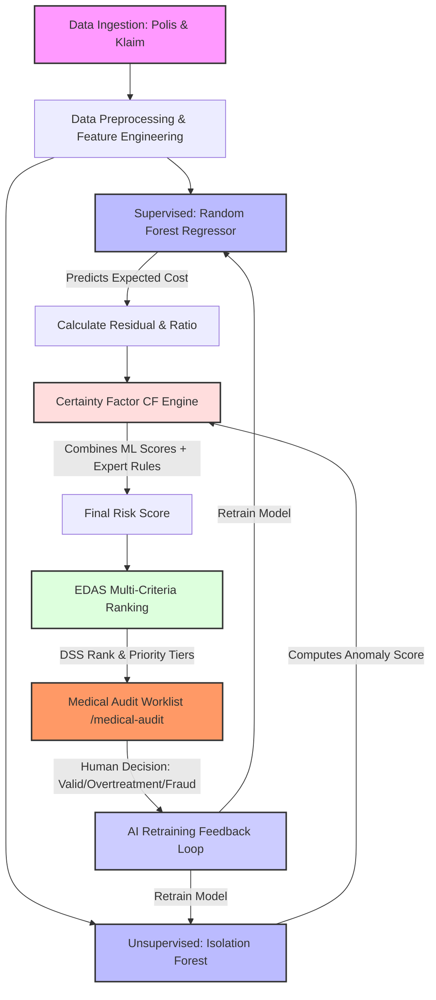
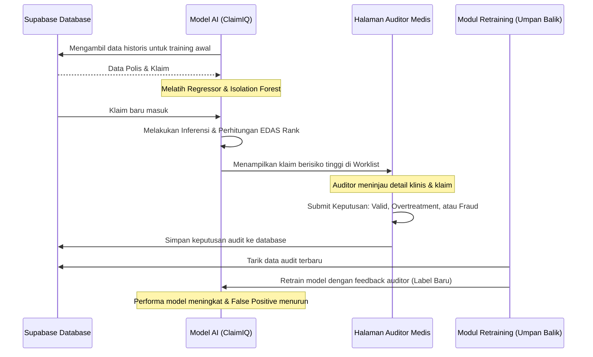

# Panduan Alur Modeling ClaimIQ (AXA-PRISM) untuk Presentasi

Dokumen ini berisi penjelasan detail, terstruktur, dan teknis mengenai alur modeling data serta kecerdasan buatan (AI) pada platform **ClaimIQ (AXA-PRISM)**. Anda dapat menggunakan panduan ini langsung untuk materi slide, catatan pembicara (*speaker notes*), atau demonstrasi saat presentasi.

---

## 📊 Gambaran Umum Arsitektur Kecerdasan Buatan (AI)

Model ClaimIQ dirancang dengan pendekatan **Hybrid AI**: menggabungkan kekuatan prediksi data (*Machine Learning*) dengan aturan pakar medis (*Expert Systems*) menggunakan logika *Certainty Factor* (Faktor Kepastian) dan algoritma pengambilan keputusan multi-kriteria (**EDAS**). Hal ini memastikan bahwa klaim yang memiliki risiko kecurangan (*fraud*) atau kelebihan tindakan (*over-treatment*) dapat dideteksi secara akurat dan diurutkan berdasarkan prioritas peninjauan oleh Auditor Medis.

---

## 🛠️ Tahap 1: Data Ingestion & Preprocessing (Data Operator)
Sebelum model melakukan analisis, data mentah divalidasi dan diolah. Proses ini dijalankan oleh peran **Data Operator** di halaman `/data-ingestion`.

1. **Sinkronisasi Data**: Menghubungkan database `policies` (polis) dan `claims` (klaim) dari Supabase.
2. **Merging & Join**: Menggabungkan data klaim dengan data polis menggunakan metode *Left Join* berbasis kunci `policy_number`.
3. **Imputasi Data Hilang (Imputation)**: Mengisi nilai kosong (*missing values*) secara otomatis:
   * Kategori default (misal: `gender` $\rightarrow$ 'M', `domicile` $\rightarrow$ 'JAKARTA', `hospital_location` $\rightarrow$ 'Indonesia').
4. **Rekayasa Fitur (Feature Engineering)**:
   * **Usia Nasabah (`usia_nasabah`)**: Dihitung berdasarkan selisih tanggal lahir dengan tanggal referensi berjalan (Januari 2026), dibatasi rentang 0-100 tahun.
   * **Lama Rawat Inap (`length_of_stay`)**: Selisih hari antara tanggal keluar (`discharge_date`) dan tanggal masuk (`admission_date`).
   * **Durasi Aktif Polis (`policy_age_days`)**: Selisih hari sejak polis efektif hingga nasabah masuk RS.
   * **Indikator Wilayah Berisiko (`high_risk_region_indicator`)**: Bernilai `1` jika perawatan dilakukan di luar Indonesia (*overseas*), dan `0` jika di dalam negeri.
   * **Frekuensi & Kecepatan Klaim (`claim_frequency` & `claim_velocity`)**: Menghitung berapa kali nasabah melakukan klaim dan frekuensi klaim per bulan untuk mendeteksi perilaku klaim berulang (*repeated claims*).
   * **Metode Pembayaran & Tipe Perawatan**: Transformasi biner untuk tipe cashless (`is_cashless`) dan rawat inap (`is_inpatient`).

---

## 🌲 Tahap 2: Supervised Learning – Expected Cost Model (Random Forest Regressor)
Model pertama bertugas memprediksi **biaya klaim yang wajar (Expected Cost)** berdasarkan karakteristik demografis nasabah dan diagnosis penyakitnya.

* **Algoritma**: **Random Forest Regressor** (100 pohon keputusan, kedalaman maksimal 15 tingkat).
* **Fitur Input**: 
  1. `usia_nasabah`
  2. `gender` (terenkode)
  3. `is_cashless` (cashless vs reimbursement)
  4. `is_inpatient` (rawat inap vs rawat jalan)
  5. `domicile` (domisili nasabah)
  6. `hospital_location` (lokasi rumah sakit)
  7. `icd_diagnosis` (kode diagnosis ICD-10)
* **Target Variabel**: `approved_claim_cost` (biaya klaim yang disetujui secara historis).
* **Metode Validasi**: Pemisahan data secara kronologis (*Chronological Split*) dengan rasio **80% data latih (train)** dan **20% data uji (test)** untuk mensimulasikan performa model pada klaim di masa depan.
* **Tujuan Akhir**: Menghasilkan nilai **Residual Cost (Selisih Biaya)**:
  $$\text{Residual Cost} = \max(0, \text{Hospital Billed Cost} - \text{Expected Claim Cost})$$
  Jika tagihan rumah sakit jauh melebihi estimasi wajar dari Random Forest, nilai residual ini akan tinggi, mengindikasikan adanya potensi **over-treatment** atau **mark-up tagihan**.

> [!TIP]
> **Poin Presentasi Unggul (Robustness & Tuning):**
> Sebutkan bahwa tim melakukan evaluasi ketahanan model melalui eksperimen **Log Transformation (`np.log1p`)** pada biaya klaim untuk mengatasi data biaya yang sangat miring (*skewed*), serta membandingkannya dengan algoritma **HistGradientBoostingRegressor** untuk memastikan Random Forest memiliki MAE (*Mean Absolute Error*) paling optimal dan stabil.

---

## 🕵️ Tahap 3: Unsupervised Learning – Anomaly Detection (Isolation Forest)
Model kedua berfokus pada deteksi pola klaim yang tidak biasa (anomali) tanpa bergantung pada label historis fraud.

* **Algoritma**: **Isolation Forest** (100 estimators, tingkat kontaminasi 5%).
* **Fitur Input**:
  1. `approved_claim_cost` (total biaya disetujui)
  2. `residual_cost` (selisih tagihan asli vs estimasi wajar model regresi)
  3. `claim_to_expected_ratio` (raso tagihan dibanding biaya wajar)
  4. `actual_vs_expected_diff` (perbedaan absolut tagihan)
  5. `claim_frequency` (frekuensi klaim polis)
  6. `claim_velocity` (kecepatan pengajuan klaim)
  7. `high_risk_region_indicator` (indikator rumah sakit luar negeri)
  8. `length_of_stay` (lama perawatan)
* **Skalabilitas**: Seluruh fitur dinormalisasi menggunakan **StandardScaler** sebelum diproses.
* **Output**: **Anomaly Score [0, 1]** (skor anomali ter-skala, di mana nilai mendekati 1 menandakan klaim tersebut sangat menyimpang dari pola normal secara statistik).

---

## 🧠 Tahap 4: Certainty Factor Engine (Integrasi Aturan Bisnis & AI)
Skor murni AI (Isolation Forest) digabungkan dengan **Aturan Pakar (Expert Rules)** menggunakan kerangka kerja logika ketidakpastian **Certainty Factor (CF)** (terinspirasi dari sistem pakar medis MYCIN). 

Hal ini dilakukan untuk meminimalkan *false alarm* (positif palsu) dan memasukkan parameter klinis/polis penting seperti riwayat perokok, BMI, dan lokasi RS.

### 1. Sumber Bukti (Evidence) & Penilaian CF:
Setiap aspek risiko dikonversi menjadi nilai Certainty Factor individu dengan rentang $[-1.0, 1.0]$:
* **CF Anomaly Score**: Dari model Isolation Forest.
* **CF Location Risk**: Risiko rumah sakit luar negeri (overseas).
* **CF Severity Risk**: Tingkat keparahan nominal biaya klaim.
* **CF Behavioral Risk**: Gabungan frekuensi klaim berulang dan kecepatan klaim.
* **CF Residual Risk**: Tingginya selisih biaya dari hasil model regresi.
* **CF Expert Input**: Berdasarkan data kesehatan nasabah seperti usia, indeks massa tubuh (BMI), dan status merokok.

### 2. Kombinasi Sekuensial:
Model menggabungkan faktor kepastian secara iteratif menggunakan rumus kombinasi standar Certainty Factor:
$$CF_{\text{combine}}(CF_1, CF_2) = 
\begin{cases} 
CF_1 + CF_2(1 - CF_1), & \text{jika } CF_1, CF_2 \ge 0 \\
CF_1 + CF_2(1 + CF_1), & \text{jika } CF_1, CF_2 < 0 \\
\frac{CF_1 + CF_2}{1 - \min(|CF_1|, |CF_2|)}, & \text{jika tanda berlawanan}
\end{cases}$$

Hasil akhirnya dinormalisasi menjadi **Final Risk Score [0, 1]** dengan bobot:
$$\text{Final Risk Score} = (0.6 \times \text{Anomaly Score Model}) + (0.4 \times \text{CF Expert Score})$$

---

## 🏆 Tahap 5: Decision Support System (EDAS Algorithm)
Untuk membantu **Medical Auditor** memprioritaskan klaim mana yang harus diperiksa terlebih dahulu dari ribuan klaim masuk, sistem menerapkan algoritma Sistem Pendukung Keputusan (DSS) bernama **EDAS (Evaluation based on Distance from Average Solution)**.

EDAS mengukur seberapa jauh sebuah klaim menyimpang secara negatif atau positif dari rata-rata klaim lainnya berdasarkan 5 kriteria penting dengan bobot tertentu:

| Kriteria Risiko | Bobot (%) | Keterangan |
| :--- | :---: | :--- |
| `approved_claim_cost` | **25%** | Besarnya nominal klaim yang diajukan |
| `residual` | **20%** | Besarnya selisih biaya dari harga wajar prediksi regressor |
| `anomaly_score` | **20%** | Tingkat keanehan klaim menurut Isolation Forest |
| `cf_score` | **20%** | Skor kepastian integrasi aturan pakar medis |
| `final_risk_score` | **15%** | Skor akumulasi risiko akhir |

### Hasil Klasifikasi Prioritas EDAS:
EDAS menghasilkan urutan peringkat (**DSS Rank**) serta mengelompokkan klaim ke dalam 4 kategori prioritas tindakan:
1. **Fraud Investigation Priority (Skor EDAS $\ge$ 0.75)**: Klaim sangat mencurigakan, langsung masuk antrean investigasi utama.
2. **Suspicious Claim (Skor EDAS 0.55 - 0.74)**: Terdapat beberapa indikasi tidak wajar, memerlukan perhatian tinggi.
3. **Review Required (Skor EDAS 0.35 - 0.54)**: Butuh klarifikasi dokumen medis dasar.
4. **Valid Claim (Skor EDAS $<$ 0.35)**: Aman untuk disetujui otomatis tanpa audit manual tambahan.

---

## 🔄 Tahap 6: Human-in-the-Loop & Retraining Loop
Sistem ClaimIQ tidak hanya berjalan satu arah. Keputusan manusia (Medical Auditor) menjadi umpan balik yang sangat berharga untuk meningkatkan performa AI.

1. **Medical Audit Worklist (`/medical-audit`)**: Auditor medis meninjau detail pasien, diagnosis penyakit, riwayat klaim, dan selisih biaya. Mereka memasukkan status verifikasi akhir (misal: Menyetujui klaim, menandai *over-treatment*, atau melaporkan sebagai indikasi fraud).
2. **Umpan Balik Retraining**: Data keputusan auditor medis disimpan ke dalam tabel audit. Pada jadwal retraining berikutnya, label aktual hasil audit ini diumpankan kembali ke dalam model latih untuk menyetel ulang batas sensitivitas Isolation Forest dan menajamkan prediksi Random Forest, sehingga di masa depan kesalahan klasifikasi (*false alarm*) dapat berkurang secara signifikan.

---

## 💡 Tips Tambahan untuk Presentasi Anda:
* **Tekankan Kolaborasi Manusia & AI**: Jelaskan bahwa AI di sini **tidak menggantikan auditor**, melainkan bertindak sebagai asisten cerdas yang memilah ribuan data klaim agar auditor fokus pada 5% klaim paling berisiko tinggi (menghemat waktu operasional hingga 80%).
* **Jelaskan Metodologi Bisnis yang Kuat**: Penggunaan algoritma seperti **EDAS** (metode DSS tepercaya) dan **Certainty Factor** menunjukkan bahwa aplikasi ini dibangun dengan landasan akademis/ilmiah yang kuat untuk industri asuransi yang berisiko tinggi, bukan sekadar tebakan AI hitam-di-atas-putih (*black-box*).
